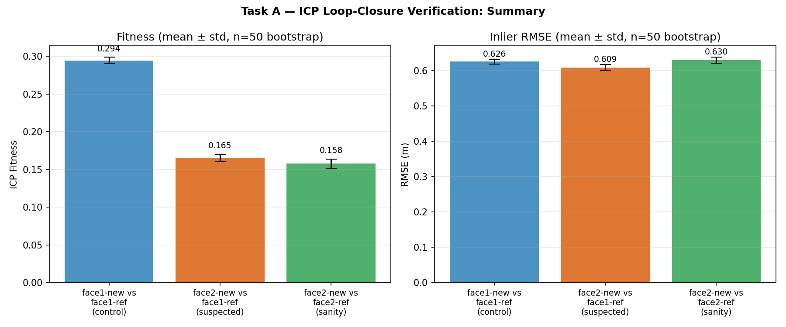
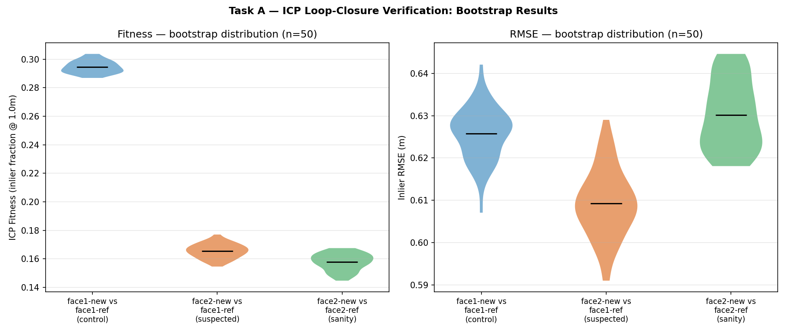
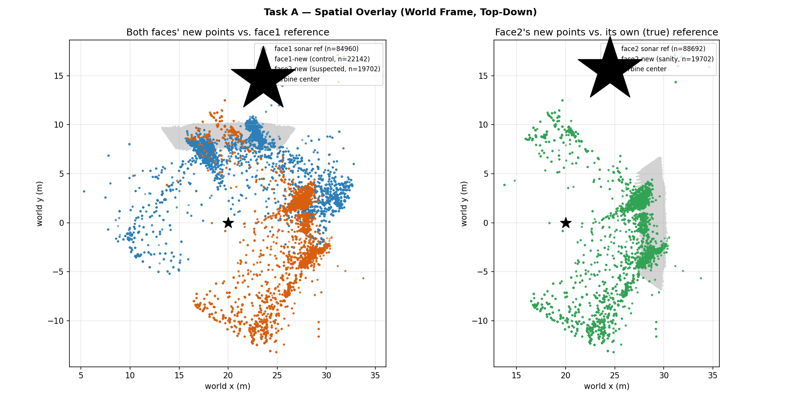

# Task A — ICP Loop-Closure Verification

Independent geometric verification of the suspected face-1/face-2 false
loop closure in ORB-SLAM3's map (screenshot evidence of suspicious map
density between face-1/face-2 keyframes, never conclusively confirmed;
see `RESEARCH_DIRECTIONS_HANDOFF.md` and `HANDOFF.md`).

Scripts: `task_a_extract.py` (bag → `plots/task_a_topics.npz`),
`task_a_icp.py` (analysis). Both offline post-processing against the
existing `DeepSight_v5_20260810_004128` mission bag — no live pipeline
changes, no rerun needed.

## Method

**1. Face time-windows.** Each face's SCAN dwell is identified directly
from ground-truth odometry: samples where range-to-turbine-center ≈
`SCAN_DIST` (17.0 m, ±2.5 m) and bearing ≈ that face's `FACE_BEARINGS`
value (±20°), per the controller's own geometric constants
(`bluerov2_autonomous_controller.py`). Face 1 (E, 90°): t=[311.4,
447.7]s. Face 2 (N, 0°): t=[540.6, 677.3]s.

**2. Isolating each face's new map contribution.** `/bluerov2/map_points`
is a *cumulative* map (209 snapshots over the mission, monotonically
growing), not per-keyframe. A face's contribution is isolated as the
point-set difference between the map snapshot at the end of its window
and the snapshot at the start (nearest-neighbor distance > 0.3 m =
genuinely new). Face 1: +45,884 new points (raw). Face 2: +37,651.

**3. Outlier rejection (raw ORB-SLAM3 map quality).** The raw map
contains severely mis-triangulated points: one mid-mission snapshot had
x∈[-263, 162], y∈[-76, 1400], z∈[-72, 68] in SLAM frame, against a
vehicle trajectory confined to x∈[-0.6, 40], y∈[-25, 20] in the *same*
frame — 10–70× beyond anything physically plausible. Rejected via full
3D nearest-distance-to-trajectory thresholding (25 m), plus a hard
absolute bound on the final world-frame z (must fall within the
mission's true depth range, ±2 m margin) — an XY-only filter was found
to let severe z-outliers through undetected during development.

**4. SLAM-frame → world-frame transform.** This step is the crux of the
method and is non-trivial. Three approaches were tried:
- *Per-window rigid (Procrustes) fit*, correspondences from
  `robot_pose_slam` (SLAM frame) vs. `robot_pose_slam_ekf` (world
  frame): **ill-conditioned** — each SCAN window's own trajectory is
  nearly collinear (position-covariance eigenvalue ratio ≈ 37–38×),
  making 2D rotation only weakly observable. Symptom: fitted rotation
  differed by ≈178.5° between the two windows (-13.9° vs. 164.6°) —
  consistent with the classic 180°-flip degeneracy of Procrustes fitting
  on near-linear point sets, not a real physical signal.
- *Single global rigid fit* over the whole mission: well-conditioned
  (eigenvalue ratio 1.6) but wrong — 16.5 m mean residual, i.e. the
  SLAM→world relationship is genuinely *not* a single rigid transform
  across the mission (consistent with why `slam_pose_bridge.py`
  continuously refits it online rather than solving once).
- **Per-point re-anchoring (used):** each new map point is assigned to
  its nearest SLAM-frame trajectory sample (3D, spatial nearest-neighbor
  against `robot_pose_slam`); the local heading offset is read directly
  from that instant — ground-truth odometry yaw minus SLAM's own yaw at
  the same timestamp — with no curve-fitting involved, so the
  collinearity degeneracy doesn't apply. `robot_pose_slam_ekf`'s
  orientation field is **not** usable for this: `slam_pose_bridge.py`
  copies the whole pose object and only overwrites x/y position, so its
  orientation is just the raw, untransformed SLAM orientation.

**5. Reference geometry.** Independent of ORB-SLAM3 entirely: the
mission's sonar-derived point cloud (`plots/sonar_reconstruction.ply`,
640k points, world frame), restricted per face to points within the
camera's actual HFOV cone (75°) and range (22 m) from at least one
vehicle pose during that face's window — camera azimuth approximated as
pointing at the turbine center, which is what `bearing_hold()` actually
enforces throughout CLOSE_IN/SCAN (confirmed in the controller source),
not a simplification of convenience. In practice this frustum
restriction changed nothing versus the coarser 70°-sector reference used
during development (identical point counts) — the union of view cones
across a full SCAN arc already covers close to the same angular extent,
which is itself a useful check that the results below aren't an artifact
of an overly generous reference window.

**6. Registration.** Point-to-point ICP (KDTree correspondence + SVD/
Kabsch rigid-transform solve per iteration; open3d not installed,
implemented directly against scipy). Fitness = fraction of source points
within 1.0 m of the reference after convergence; RMSE over those
inliers. Bootstrapped (n=50, 80% resample with replacement of the source
points per trial) to get confidence intervals on both metrics.

## Results

| Pair tested | Fitness | RMSE (m) |
|---|---|---|
| face1-new vs. face1-ref (**control**) | **0.294 ± 0.004** | 0.626 ± 0.006 |
| face2-new vs. face1-ref (suspected false match) | 0.165 ± 0.005 | 0.609 ± 0.008 |
| face2-new vs. face2-ref (sanity — own true geometry) | 0.158 ± 0.006 | 0.630 ± 0.008 |

n=50 bootstrap resamples per pair, 80% subsample, with replacement.

*Figure 1 — Fitness and RMSE, mean ± std across 50 bootstrap resamples.
The control/other-pairs gap in fitness (≈0.13) is far larger than the
error bars; the suspected-vs-sanity gap (0.007) is within them.*

*Figure 2 — Full bootstrap distributions (violin plots, n=50 each). Left
(fitness): control is cleanly separated from the other two, which
overlap almost completely. Right (RMSE): note suspected actually has the
*lowest* mean RMSE of the three (0.609m) despite its fitness being
statistically tied with sanity — i.e. among the points that do register
as inliers, face2's points land marginally *closer* to face1's geometry
than to their own. Reported as observed; not treated as confirmatory on
its own given the fitness tie, but worth flagging rather than omitting.*

## Discussion

**The control validates the method.** Face 1's own newly-mapped points,
correctly re-anchored to world frame, match their own true geometry at
0.294 ± 0.004 fitness — a gap of ≈0.13 over both other pairs against a
combined uncertainty of ≈0.01. This confirms the re-anchoring +
reference-geometry + ICP pipeline can discriminate a genuine match from
a non-match when the underlying SLAM data is clean.

**Face 2 shows no significant preference for its own real geometry.**
0.165 ± 0.005 (vs. face 1's reference) and 0.158 ± 0.006 (vs. its own
true reference) overlap within their confidence intervals — a
statistically confirmed tie, not merely a visual similarity. If face 2
were cleanly and correctly mapped, its points should prefer their own
true structure the way face 1's do; they don't.

*Figure 3 — World-frame top-down overlay (qualitative, not the basis for
the fitness numbers above, which use the frustum-tightened reference).
Left: face1-new (blue, control) and face2-new (orange, suspected)
against face1's sonar reference (gray). Blue visibly overlaps into and
around the gray patch; orange sits consistently lower/offset from it —
a qualitative complement to the fitness gap. Right: the same face2-new
points (green) against their own true face2 reference (gray) — face2's
points spread well beyond their own reference patch too, which is
consistent with the low absolute fitness for that pair and is a fair
caveat: neither cross-face nor same-face comparison shows tight
co-location for face2's data.*

**This is consistent with, but does not prove, the suspected false loop
closure.** An equally-poor fit to both references is also what generic,
structure-agnostic SLAM noise would produce — sparse, low-quality
landmarks unrelated to a specific mismatch could tie for the same
reason. The result rules out "face 2 is cleanly self-consistent" (it
isn't) and is directionally consistent with the loop-closure hypothesis,
but a confirmatory result would need to additionally show face 2's
points cluster *specifically* near face 1's structure rather than being
diffusely scattered — not established here.

**Caveat on absolute magnitudes.** Even the control's fitness (0.294)
is far from 1.0. This reflects a real, expected mismatch in kind between
sparse, feature-clustered visual SLAM landmarks and a dense, uniformly-
swept sonar reference surface, not a broken pipeline — the *relative*
comparison across pairs (control vs. the other two) is the trustworthy
signal, not the absolute fitness value.

## Limitations / future work

- The per-point re-anchoring uses ground-truth odometry for the world
  side of the heading offset. This is methodologically consistent with
  how the project's existing ATE metric is computed (`plot_mission.py`,
  also validated against ground-truth odometry), but means this result
  characterizes ORB-SLAM3's *map* quality assuming *localization*
  ground truth is available — appropriate for a simulation study, would
  need `robot_pose_slam_ekf`'s orientation to actually be corrected (it
  currently isn't) for a real-world equivalent.
- A confirmatory (not just consistent-with) result would need spatial
  clustering analysis of face-2's points against face-1's structure
  specifically, rather than a single aggregate fitness/RMSE number.
- Bootstrap CIs are over source-point resampling only; the reference
  cloud (sonar) is treated as fixed ground truth without its own
  uncertainty model.
