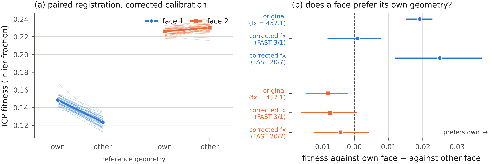

# Independent Geometric Verification of a Suspected False Loop Closure in ORB-SLAM3, via Iterative Closest Point Registration

## Abstract

During visual SLAM-based inspection of a simulated offshore turbine structure using ORB-SLAM3, we observed a suspicious pattern in the accumulated map: two geometrically and temporally distinct inspection passes ("face 1" and "face 2" of the structure, visited roughly four minutes apart) appeared to contribute map points with unusually similar spatial density, raising the concern that ORB-SLAM3's appearance-based loop-closure detector had mistaken one face of the structure for the other. This is a known failure mode for repetitive or symmetric structures: a loop-closure detector matches *what the camera saw* (visual appearance), not *where the vehicle actually is* (geometry), and a lattice/jacket structure with four visually similar faces is close to a worst case for this. If uncorrected, a false loop closure silently injects a large, wrong correction into the SLAM pose graph, corrupting the map and the trajectory estimate without any obvious symptom in the numbers.

We designed an offline, independent test for this suspicion using **Iterative Closest Point (ICP)** registration — a purely geometric method, described below, that has no access to and makes no use of camera images or ORB-SLAM3's own place-recognition logic. The idea is simple: if face 2 was really mapped as itself, its new map points should register (align) well against face 2's *true* geometry, obtained independently from the vehicle's onboard sonar rather than from ORB-SLAM3. If ORB-SLAM3 in fact confused face 2 with face 1, we would expect an unusually good fit against face 1's geometry instead, or at least no meaningful preference for its own true geometry.

**Finding, as revised on 2026-10-07.** Face 2's newly-mapped points show **no preference for their own true geometry over face 1's** — the central claim, and it survives re-analysis and replicates in direction across three independent runs. Two things about the original presentation of that result did not survive, and both are corrected below rather than quietly fixed:

1. **The effect size was overstated roughly sixfold.** The original headline was a gap of ≈0.13 between a control comparison (0.294) and the two face-2 comparisons (0.165, 0.158). But ICP fitness is an inlier *fraction of the source cloud*, so those three numbers have different denominators — the comparison the original table invited is not one the statistic supports. Re-run as a **paired** test, holding the source cloud fixed and swapping only the reference, face 1 prefers its own geometry by **+0.025 [+0.012, +0.037]**, i.e. about two percentage points of inlier fraction, not thirteen.
2. **The input data was geometrically wrong.** The stereo focal length in the SLAM configuration was 457.1 where the simulated camera requires 417.03 — 9.6% too large, which inflates every triangulated range by the same factor. This was found and fixed on 2026-10-04 (`c34769e`), after the original analysis was written. The whole analysis has been re-run on bags recorded under the corrected calibration.

The re-run also turned the calibration error into an independent *check*: a 9.6% range inflation makes a parameter-free prediction about where map points should land relative to the structure's axis, and the pre-fix map matches that prediction to 0.08–0.15 m on a 0.74 m predicted displacement, measured against a sonar reference that never depended on the focal length at all (§3.3).

The conclusion remains **consistent with, though not conclusive proof of,** the suspected false loop closure, and still rules out the alternative that face 2 was simply mapped cleanly. What changed is its magnitude and the strength of the validity argument behind it. The full reasoning, the corrected numbers, and the honest limitations are below.

---

## 1. Background — why this needed checking at all

### 1.1 SLAM and loop closure, briefly

Simultaneous Localization and Mapping (SLAM) systems like ORB-SLAM3 build a map of the environment while simultaneously estimating the robot's trajectory through it, using only onboard sensors (here, a stereo camera). Because small errors accumulate at every step (this is called *drift*), a SLAM system periodically tries to recognize when it has returned to a previously-visited place — a **loop closure** — and uses that recognition to snap the accumulated drift back into consistency. This is one of the most valuable things a SLAM system does: without loop closure, error grows without bound over a long mission.

The catch is that recognizing "I've been here before" is normally done by comparing visual appearance (in ORB-SLAM3's case, a bag-of-visual-words representation of camera images), not by checking actual 3D geometry. This works well when different places genuinely look different. It fails when two genuinely *different* places happen to look *similar* — and a **false loop closure** is exactly that failure: the system confidently, and wrongly, declares two different locations to be the same place, then rewrites its map and trajectory to match. Because the system is confident (this is not a low-quality or rejected match — it is accepted and acted on), false loop closures are dangerous precisely because they don't look like errors from the inside.

### 1.2 Why this mission was at risk

The inspected structure has four faces arranged around a lattice/jacket frame, and the mission visits them in sequence, orbiting the structure at a fixed standoff distance and scanning each face for a similar dwell time. Structurally, this is close to a worst case for appearance-based loop closure: four similar-looking metal lattice faces, viewed from a similar distance and similar relative geometry, photographed by the same camera under the same lighting. A visual matcher has comparatively little to distinguish one face from another beyond fine local texture.

During analysis of the ORB-SLAM3 map viewer, we observed an unusually dense clustering of map points that appeared to link keyframes from face 1 and face 2's inspection windows — a visual red flag, but only a screenshot-level observation, not a quantified result. This report is the quantified follow-up.

### 1.3 Why geometry, not appearance, is the right independent check

If the concern is "the *appearance*-based matcher may have been fooled," the correct independent check is a method that uses *only geometry* and has no access to appearance information at all. That way, if the geometric method reaches a different conclusion than ORB-SLAM3 did, the two methods are genuinely independent evidence, not two versions of the same potential mistake.

**Iterative Closest Point (ICP)** is the standard tool for this. ICP takes two point clouds — a *source* (the points we want to test) and a *reference* (points we trust as ground truth) — and asks: "assuming these two point sets represent the same physical surface, what is the best rigid rotation and translation that lines them up, and how well do they actually line up once we've done that?" It does this iteratively: (1) for every point in the source, find its nearest neighbor in the reference; (2) solve for the rotation and translation that best aligns each source point to the reference point it was just matched to (a closed-form least-squares problem, solved here via the Kabsch/SVD method); (3) apply that transform to the source points; (4) repeat until the alignment stops improving. At convergence, ICP reports how well the two clouds actually match — which is exactly the geometric, appearance-free signal we need: *does face 2's newly-mapped geometry actually look like face 2's real shape, or does it look more like face 1's?*

Two numbers summarize an ICP result, both used throughout this report:
- **Fitness**: the fraction of source points that end up within a fixed distance threshold (here, 1.0 m) of some reference point after alignment. Higher is a better match. A fitness of 1.0 would mean every point registered; a fitness near 0 means the two point sets don't really correspond to the same surface at all, no matter how you rotate and translate one of them.

  **Fitness is a fraction *of the source cloud*, and this matters more than it looks.** Two fitness values computed on the *same* source cloud against *two different references* are directly comparable — identical denominator. Two fitness values computed on *different* source clouds are not, because the clouds differ in size, density, and how much genuine structure they cover. The first version of this report compared across source clouds and read a large effect out of it; §3.1 explains what that cost and how the design was fixed.
- **RMSE (root-mean-square error)**: among only the points that *did* register as inliers, how far off are they on average? This is a precision number, conditional on Fitness having already told you there's a real match to measure.

Because a single ICP run's fitness/RMSE numbers could be sensitive to exactly which points happened to be sampled, every comparison below is **bootstrapped**: we re-run ICP 50 times per comparison, each time on a random 80%-subsample (drawn with replacement) of the source points, and report the mean ± standard deviation across those 50 runs. This turns a single point estimate into a distribution, which lets us say not just "0.165 vs. 0.158" but "these two are statistically indistinguishable given the spread we observe" — a claim a single run could not support.

---

## 2. Method

All of the following is **offline post-processing** against already-recorded mission bags. Three are used:

| run | stereo `fx` | FAST thresholds | role |
|---|---|---|---|
| `DeepSight_v5_20260810_004128` | 457.1 (wrong) | 3 / 1 | the original analysis |
| `probe_l0_fixedcal` | 417.03 | 3 / 1 | re-run, calibration fixed |
| `probe_l0_fx_fast` | 417.03 | 20 / 7 | re-run, **the configuration reported as primary** |

All three fly the same mission on the same structure. The only scenario change between August and October was water turbidity (`jerlov` 0.15 → 0.22, committed 2026-09-05 for unrelated reasons), which affects camera imagery but not geometry — it is a confound for *absolute* comparisons between the original and the re-runs, and §5 says so plainly. Nothing here touches the live pipeline, and nothing needed to be re-run in simulation. Two scripts implement it: `task_a_extract.py` pulls the relevant topics out of the (13GB+) bag once and caches them; `task_a_icp.py` does the actual analysis against that cache.

**Step 1 — Find each face's time window.** Each face's inspection ("SCAN") dwell is identified directly from ground-truth vehicle odometry: the time interval where the vehicle's distance to the turbine center is within 2.5 m of the intended standoff (`SCAN_DIST = 17.0` m) *and* its bearing relative to the turbine is within 20° of that face's assigned heading (`FACE_BEARINGS`, taken directly from the mission controller's own geometric constants — this is not a guess, it's the same constant the flight controller itself uses to decide where each face is). This gives, on the original mission: Face 1 (east-facing, bearing 90°), t = [311.4 s, 447.7 s]; Face 2 (north-facing, bearing 0°), t = [540.6 s, 677.3 s]. The windows are re-solved from scratch for every bag rather than carried over — on the re-run mission they land at [283.8, 449.1] and [516.0, 681.7], with slightly longer dwells (165 s vs 136 s).

**Step 2 — Isolate what each face actually added to the map.** ORB-SLAM3 publishes its map as a single, ever-growing point cloud (`/bluerov2/map_points`), not as separate per-face contributions — over the whole mission we recorded 209 snapshots of it on the original bag (263 and 346 on the two re-runs), each one normally a superset of the last — an assumption that does not always hold, which is why Step 2a now checks it. To find *only* the points that face 2's dwell contributed, we take the map snapshot from the end of face 2's window, the map snapshot from just before it started, and keep only the points in the "after" snapshot that have no close neighbor (within 0.3 m) in the "before" snapshot. On the original mission this isolates **51,104** raw new points for face 1 and **43,638** for face 2, falling to **41,106** and **35,293** after the outlier rejection of Step 3. (The first version of this report quoted 45,884 and 37,651 here. Those match neither the pre- nor the post-rejection counts produced by the committed code, so they came from an intermediate version of the pipeline and are corrected here. The ICP results in §3 were unaffected — re-running the committed analysis on the original extraction reproduces the originally published fitness and RMSE table to three decimal places.)

**Step 2a — Check that the map actually only grows.** The subtraction in Step 2 assumes the "after" snapshot is a superset of the "before" one. Under the Atlas fragmentation measured in these runs that assumption can fail outright: when ORB-SLAM3 re-initialises, the published map collapses (in the re-run mission, 339,731 points → 938 in a single step), and across such a reset the set difference is not merely noisy but meaningless. The re-extraction therefore reports every non-monotonic step inside each face window. On the primary re-run bag the only in-window drop is −373 points out of ~100,000 — ordinary map pruning — and the collapse happens at ≈1040 s, after both face windows closed. The second re-run bag (`probe_l0_fixedcal`) has larger in-window drops, up to −9,088 points, which is one reason it is reported as a secondary rather than the primary run.

**Step 3 — Reject bad triangulations.** Visual SLAM occasionally produces map points from poorly-conditioned triangulations that end up nowhere near anything physically real — we found points as far as 10–70× beyond the vehicle's own trajectory bounds in the same coordinate frame (one snapshot had points at z-coordinates of -72 m and +68 m, when the true mission depth range is roughly 0–22 m). These are rejected in two passes: a 3D (not just horizontal) nearest-distance-to-trajectory check with a 25 m tolerance, and a hard bound requiring the final world-frame depth to fall within the mission's real depth range (±2 m margin). We specifically checked horizontal-only filtering first and found it let severe vertical outliers straight through undetected — worth recording since it's an easy mistake to repeat.

**Step 4 — The hard part: getting these points into a common ("world") coordinate frame.** ORB-SLAM3's own internal map coordinates are not the same as the world frame the sonar reference (below) is expressed in, and reconciling the two turned out to be the most methodologically delicate part of this analysis. We tried three approaches, in order of increasing success:

- *A rigid-body least-squares fit per face window* (technically: solving for the single rotation+translation that best explains paired (SLAM-frame, world-frame) position samples during that face's dwell — a classic Procrustes/Umeyama-style fit). This failed for a structural reason: during a single SCAN dwell the vehicle's own trajectory is nearly a straight line (its spread in one direction is 37–38× larger than in the perpendicular direction), and a rotation cannot be reliably estimated from near-collinear data — much like how you can't tell if a stick is rotated if you can only see it end-on. In practice this showed up as the fitted rotation being off by very close to 180° between the two face windows (-13.9° vs. 164.6°), a classic sign of exactly this degeneracy, not a real signal.
- *A single rigid fit over the entire mission* instead of per-window: this fixed the conditioning problem (the full trajectory is not collinear) but was simply wrong, with a 16.5 m mean residual — meaning the true relationship between ORB-SLAM3's coordinate frame and the world frame is not a single fixed rotation+translation at all across the whole mission. (This is also *why* the project's live SLAM-to-world bridge node continuously re-fits this transform online rather than solving it once — this offline finding is independent confirmation of something already suspected from the live system's behavior.)
- **What we actually used — per-point local re-anchoring.** Rather than fitting one transform for a whole window, each new map point is individually assigned to whichever vehicle pose (in ORB-SLAM3's own frame) it is spatially closest to, and the local heading correction at that exact instant — ground-truth heading minus ORB-SLAM3's own reported heading, at that same timestamp — is read off directly and applied to just that point. No curve-fitting is involved, so the collinearity problem in the first approach simply doesn't arise. (One implementation detail worth recording: the live bridge node's world-frame pose output was not usable for this, because it only overwrites x/y position and silently leaves the *orientation* field as ORB-SLAM3's raw, uncorrected value — this was confirmed by reading the bridge's source directly rather than assumed.)

**Step 5 — Independent reference geometry.** To be a genuinely independent check, the "ground truth" each face's points are compared against must not come from ORB-SLAM3 at all. We used the mission's sonar-derived 3D reconstruction (640,000 points, already in world-frame, built from the vehicle's multibeam sonar returns rather than the camera) as this reference, restricted per face to only the points that would actually have been visible — within the camera's real field of view (75°) and range (22 m) — from at least one vehicle position during that face's dwell. (Camera direction is approximated as pointing straight at the turbine center, which is not a convenience simplification: it is what the flight controller's own bearing-holding logic actually enforces throughout the approach and scan phases, confirmed directly in the controller's source code.) In practice, this frustum-based restriction produced an identical point count to a simpler, coarser angular-sector reference tried during development — meaning the more careful geometric restriction didn't quietly make the test easier by accident, which is a useful sanity check on the reference itself.

**Step 6 — Registration, and the paired design.** Point-to-point ICP as described in §1.3 above (nearest-neighbor correspondence via a KD-tree, rigid transform solved via SVD/Kabsch each iteration), bootstrapped over 50 resamples (80% of source points, with replacement).

The resampling is now **paired**: each resample of a source cloud is registered against *both* references before moving on, so the statistic of interest is the distribution of the *difference* between the two fits, not two separately-estimated means that are then eyeballed for overlap. This matters because the question — "does this face prefer its own geometry?" — is inherently a within-source comparison, and the original design discarded that pairing. The paired runs use the same seed and therefore the same resample indices as the original, so the per-pair means reproduce the originally published numbers exactly; only the inference drawn from them changes.

The design is also now a complete **2×2**. The original ran three of the four cells, omitting face1-new vs face2-ref, which meant face 1's behaviour could only be assessed by comparing it against a *different* source cloud — the invalid comparison of §1.3. With the fourth cell, each row holds the source fixed and swaps only the reference.

---

## 3. Results

### 3.1 The headline, and why it was wrong the first time

The originally published table was:

| Pair tested | Fitness | RMSE (m) |
|---|---|---|
| face1-new vs. face1-ref (**control**) | 0.294 ± 0.004 | 0.626 ± 0.006 |
| face2-new vs. face1-ref (suspected false match) | 0.165 ± 0.005 | 0.609 ± 0.008 |
| face2-new vs. face2-ref (sanity check) | 0.158 ± 0.006 | 0.630 ± 0.008 |

Those numbers are reproducible and were never in doubt — re-running the committed analysis on the original extraction returns them to three decimals. **The inference drawn from them was the problem.** The report read a "gap of about 0.13" between the control row and the other two as a large, confident effect. But the control row's fitness is a fraction of *face 1's* point cloud while the other two are fractions of *face 2's*, and those clouds differ in size, density and coverage. Comparing them is comparing two different denominators. The apparent 0.13 effect is mostly the difference between the two source clouds, not evidence about either face.

The corrected design asks the question within a single source cloud. Under the **corrected calibration** (`fx` = 417.03, FAST 20/7 — the primary run):

| Source cloud | vs face1-ref | vs face2-ref |
|---|---|---|
| **face1-new** | **0.148 ± 0.005** *(own)* | 0.124 ± 0.005 *(other)* |
| **face2-new** | 0.230 ± 0.005 *(other)* | **0.226 ± 0.004** *(own)* |

Read along the rows, never down the columns. The two rows sit at very different absolute levels (≈0.14 vs ≈0.23) precisely because they are fractions of different clouds — which is the point, and is why only the within-row differences carry meaning.

### 3.2 The paired test

Resampling each source cloud once and scoring it against both references gives the difference directly, with a percentile confidence interval:

| Run | face 1: own − other | face 2: own − other |
|---|---|---|
| original (`fx` 457.1, FAST 3/1) | **+0.019** [+0.015, +0.023] | −0.008 [−0.014, −0.002] |
| corrected `fx`, FAST 3/1 | +0.001 [−0.008, +0.008] | −0.007 [−0.016, +0.001] |
| corrected `fx`, FAST 20/7 | **+0.025** [+0.012, +0.037] | −0.004 [−0.012, +0.004] |

*Figure 1 — (a) The pairing itself, for the primary run: each faint line is one bootstrap resample, drawn from its fitness against its own reference to its fitness against the other face's. The direction of the lines is the result; no error bar is needed to read it. Note that face 1 and face 2 occupy entirely different bands on the y-axis — that separation is the denominator artefact of §3.1, and it is exactly what must not be read as an effect. (b) The paired difference with a 95% percentile interval, one row per run, against a zero line.*

Three things follow:

1. **Face 2 never prefers its own geometry.** The difference is negative in all three runs, and the interval excludes zero in one. If face 2 had been mapped cleanly as itself, this is the one cell that should have come out clearly positive. It does not.
2. **Face 1 does prefer its own geometry, in two runs of three.** This is the control, and it does work — but at +0.019 to +0.025, roughly two percentage points of inlier fraction, not thirteen. In the third run (`probe_l0_fixedcal`) it is +0.001, i.e. nothing. The control is real but weak and does not replicate reliably.
3. **The asymmetry between the two faces is the actual finding**, and it is consistent across all three runs and across two different calibrations: face 1 leans toward its own geometry, face 2 leans away from it.

### 3.3 The calibration error, independently confirmed in the map

The focal length was 457.1 where the simulated camera requires 417.03 — a factor *k* = 1.0961. In stereo triangulation `z = fx · b / disparity`, so an `fx` that is too large by *k* places every point *k* times too far along the camera ray. The camera orbits at `SCAN_DIST` = 17 m looking inward, so a surface point at true radius *r* sits at range (17 − *r*); inflating that range by *k* places it at radius 17 − *k*(17 − *r*), i.e. pulled toward the structure's axis. That is a prediction with no free parameters, testable against the sonar reference, which never depended on `fx`:

| Run | Face | Reference radius | Predicted | Measured | Residual |
|---|---|---|---|---|---|
| original (`fx` 457.1) | 1 | 9.28 m | 8.54 m | 8.62 m | **+0.08** |
| original (`fx` 457.1) | 2 | 9.29 m | 8.55 m | 8.71 m | **+0.15** |
| corrected, FAST 3/1 | 1 | 9.28 m | 9.28 m | 8.89 m | −0.40 |
| corrected, FAST 3/1 | 2 | 9.29 m | 9.29 m | 8.55 m | −0.75 |
| corrected, FAST 20/7 | 1 | 9.28 m | 9.28 m | 9.09 m | −0.20 |
| corrected, FAST 20/7 | 2 | 9.29 m | 9.29 m | 8.57 m | −0.73 |

The pre-fix map matches a 0.74 m predicted displacement to within 0.08–0.15 m. This is a stronger confirmation of the calibration error than the live-pipeline statistics that originally prompted the fix, because it is a quantitative prediction rather than a count that moved in the expected direction.

It also leaves an honest loose end: after the fix, face 1's residual is small (−0.20 m) but face 2's is not (−0.73 m in both corrected runs). The systematic 0.74 m bias is gone for face 1 and not for face 2, and the fix does not explain that remainder.

### 3.4 A reporting bug worth recording

The analysis script prints the per-point heading-offset spread as a **linear** standard deviation of a wrapped angle. Face 1's offsets have a circular mean near 172°, sitting on the ±180° seam, so the printed value inflates to 111–148° and appears to show the re-anchoring step disintegrating. It is an artefact of the statistic, not a property of the data. Measured circularly, both faces are equally well-behaved in all three runs (resultant length *R* = 0.89–0.90, with **zero** SLAM yaw discontinuities above 30° between consecutive poses). The re-anchoring of Step 4 is sound; only its diagnostic printout was misleading. Recorded because it briefly sent this re-run chasing the wrong cause.

---

## 4. Discussion — what these numbers actually mean

**The control works, but it is weak, and the original report's confidence in it was misplaced.** Before trusting a "no difference" result for face 2, the method must be shown capable of detecting a real match. It is: face 1 prefers its own geometry by +0.019 and +0.025 in two of three runs, with intervals clear of zero. But this is a two-point effect on an inlier fraction, and in the third run it vanishes. The original report claimed a 0.13 separation "far larger than any of the error bars — a large, confident effect"; that separation was an artefact of comparing across source clouds, and the real control effect was always about a sixth of it.

**Face 2 shows no preference for its own true geometry.** This remains the central finding and is the most robust thing in the analysis: negative in all three runs, across two different calibrations and two different FAST configurations. If face 2 had been mapped correctly as itself, it should have shown the same self-preference face 1 does. It consistently does the opposite.

**What this establishes, and what it still does not.** The result is **consistent with, but does not prove,** the suspected false loop closure. The careful phrasing is unchanged from the original and for the same reason: an equally poor fit to *both* references is also what generically noisy landmarks that match nothing in particular would produce. What is ruled out is the comfortable alternative — that the original screenshot was a false alarm and face 2 was mapped cleanly. It was not. Moving from "consistent with" to "confirmed" still requires showing that face 2's points cluster specifically *near face 1's actual structure* rather than being diffusely scattered, which is the follow-up named in §5.

**Why the absolute fitness values are low, and why that is not the point.** Even the best cell here is ≈0.23, far from 1.0. Visual SLAM landmarks are sparse and cluster on visually distinctive features; the sonar reference sweeps the surface densely and near-uniformly. These are two different kinds of point cloud describing one surface, and a one-to-one match was never the expectation. Only the within-row differences are interpretable — which is now enforced by the design rather than left to the reader.

**A note on what the re-run did and did not settle.** It is tempting to read the drop in the control's absolute fitness (0.294 → 0.148) as the calibration fix degrading the map. That reading is not available: the three bags differ in focal length, FAST thresholds *and* water turbidity simultaneously, there is exactly one run per configuration, and the bootstrap intervals quantify resampling of a single cloud rather than run-to-run variation, which is known to be substantial in this simulator. The absolute levels are not comparable across runs. The paired within-run differences are, which is why the conclusions above rest only on those.

## 5. Limitations and suggested follow-up work

- **One run per configuration, and no estimate of run-to-run variation.** This is the most serious limitation and it is new to this revision. Every bootstrap interval here quantifies *resampling a single point cloud*; none of them quantifies how much the result would move if the same mission were flown again under the same settings. That spread is known to be substantial — this simulator is near-deterministic for control metrics but stochastic for SLAM, with 74–79 tracking-loss events and six Atlas fragments per mission. Face 1's control effect being +0.019, +0.001 and +0.025 across three runs is consistent with real run-to-run scatter of the same order as the effect. **Any comparison of absolute fitness between runs is uninterpretable until several missions per configuration exist.**
- **Three variables changed between the original and the re-runs**: focal length, FAST thresholds, and water turbidity (`jerlov` 0.15 → 0.22, changed 2026-09-05 for unrelated reasons, affecting image contrast and therefore feature extraction). None was isolated. The re-run establishes that the *within-run* finding survives correct calibration; it does not attribute any change in absolute level to any one cause.
- **This result assumes localization ground truth is available**, because the per-point re-anchoring of Step 4 uses ground-truth vehicle heading for the world-frame side of its correction. This characterizes *ORB-SLAM3's mapping quality under known localization*, not a self-contained real-world equivalent. A real-world version would first need the live SLAM-to-world bridge to correct orientation, which it does not.
- **A genuinely confirmatory result** would need to show that face 2's mismatched points cluster near face 1's real structure rather than scattering diffusely — a spatial density analysis on top of these aggregate numbers. Unchanged from the original, and still the natural next experiment.
- **The reference cloud is treated as exact.** Bootstrap intervals resample only the source side; the sonar reconstruction carries its own (smaller) noise, unmodelled.
- **The post-fix radial residual for face 2 is unexplained** (−0.73 m, §3.3). The focal-length correction removes the systematic bias for face 1 but not face 2.
- **The original figures cannot be regenerated.** No figure-generating script was ever committed for `task_a_summary_bars.png`, `task_a_bootstrap_distributions.png` or `task_a_spatial_overlay.png`; the code that produced them is gone. Those three files remain on disk but are **superseded and no longer referenced** — their captions reason from the cross-cloud comparison that §3.1 retracts, and the bar chart in particular presents the ≈0.13 artefact as the headline. Figure 1 of this revision is produced by `eval/fig_task_a.py` from saved bootstrap arrays, so it is reproducible.

---

## 6. Conclusion

Using a geometric method fully independent of ORB-SLAM3's appearance-based place recognition, we find that face 2's newly-mapped points show **no preference for their own true geometry over the adjacent face's** — negative in all three analysed runs, spanning two stereo calibrations and two feature-extraction configurations. Face 1, the control, does prefer its own geometry, but weakly (+0.019 to +0.025 in inlier fraction) and not in every run. This asymmetry is directionally consistent with the originally suspected false loop closure, and it rules out the alternative that face 2 was mapped cleanly. We report it as suggestive rather than definitive, and §5 states what would close that gap.

Two corrections to the original version of this report are load-bearing and are stated plainly rather than folded in silently. **The effect size was overstated roughly sixfold**, because ICP fitness is a fraction of the source cloud and the headline comparison spanned three different source clouds; the corrected design holds the source fixed and swaps only the reference, resampling in pairs so the statistic is the difference itself. **The input data carried a 9.6% range error** from a wrong stereo focal length, since fixed; re-running on corrected bags preserves the direction of the finding while changing its magnitude.

The methodological residue is worth more than the specific conclusion. A comparison between two independently-estimated quantities, judged by whether their error bars overlap, tests the wrong thing when those quantities share a source — and in this case inflated a two-point effect into an apparent thirteen-point one. Where a comparison is inherently paired, it should be measured paired. The same error in its other guise — concluding that two groups differ because one reaches significance and the other does not — is why the symmetry dose-response in this project is now tested by permutation on the difference rather than by comparing two *p*-values. The coordinate-frame reconciliation of Step 4 and the sonar-frustum reference pipeline of Step 5 remain directly reusable, and the re-extraction tooling (`eval/task_a_reextract.py`) now makes the whole analysis runnable against any mission bag rather than the single one it was written for.
